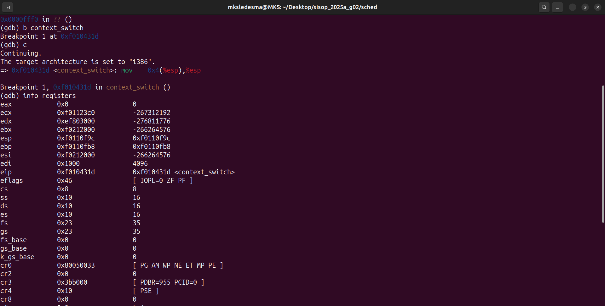
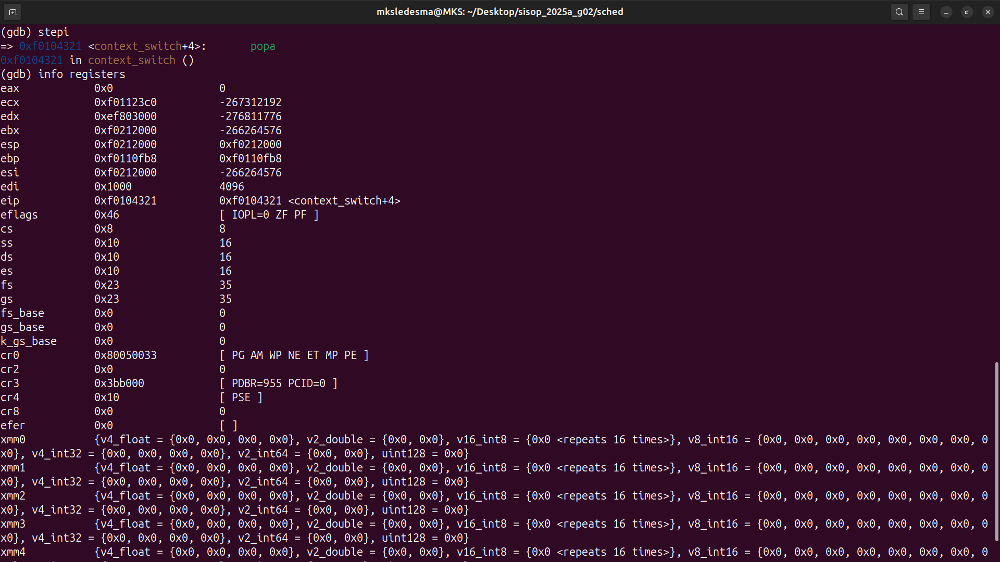
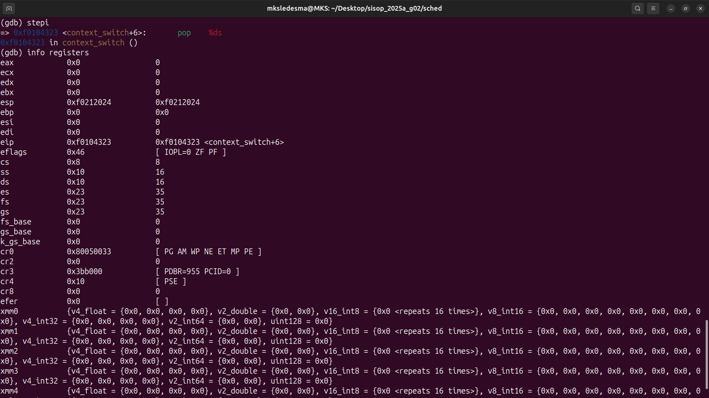
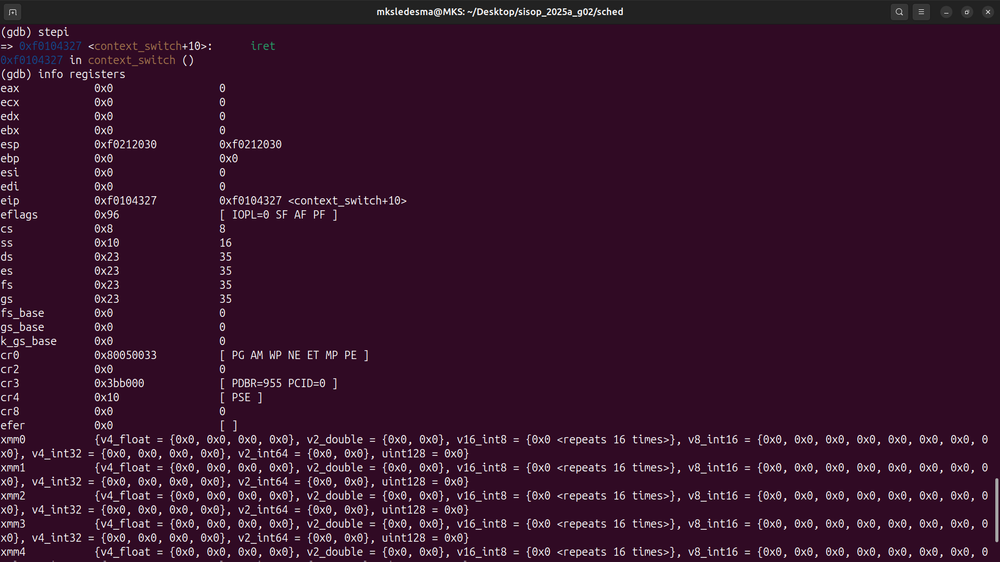
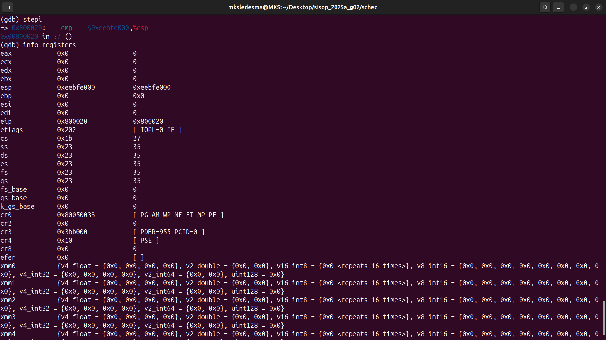

# sched

Lugar para respuestas en prosa, seguimientos con GDB y documentación del TP.

## Context switch
Seguimiento instrucción a instrucción con GDB para visualizar el cambio de contexto.

Se coloca un breakpoint en la función `context_switch`.

- `mov 4(%esp), %esp` Se visualiza el estado inicial de los registros, con esta instrucción se apunta al primer elemento del struct Trapframe (tf_regs).

- `popal` Se hace pop al Trapframe y se cargan unicamente los registros del struct PushRegs.

- `pop %es` Carga del registro %es.

- `pop %ds` Carga del registro %ds.
 
- `add $8, %esp` Evito tf_trapno y tf_err dentro del Trapframe.

- `iret` Se restauran los valores de eip, eflags, cs y esp con los del Trapframe.

- `post iret` Se visualiza como se modifican los registros luego de ejecutar iret.

## Scheduler con prioridades  

Para el manejo del scheduler con prioridades, se decidió que será desde 0 hasta 5, 
siendo el 5 la prioridad más importante.  

1. `Inicialización de la priodidad`: Al comienzo de la creación de los procesos, se tendrá 
como prioridad de entrada el 5, osea, todos los procesos serán 
importantes para cuando se inicia el scheduler.  

2. `Busqueda y ejecución de procesos`: Se va a buscar, en el array de `envs[NENV]`, el proceso que 
esté en etado `ENV_RUNNABLE` con mayor prioridad, una vez que se encuentre, se ejecutará ese proceso y se 
aumentará en 1 la cantidad de veces que se ha ejecutado dicho proceso. 

3. `Reducción de Prioridades`: Cuando un proceso se ejecutó 3 veces, se degrada se prioridad, 
de esata manera, solo los procesos con un prioridad alta serán ejecutados.

4. `Reacomodo de prioridades`: Una vez se haya ejecutado una cantidad de veces el scheduler, significa que
todos los procesos van a tener sus prioridades bajas, entonces, para que no se queden 
en un stado de `starvation`, todos vuelven a ser importante nuevamente, o sea, todos vuelven a tener la 
máxima prioridad.
