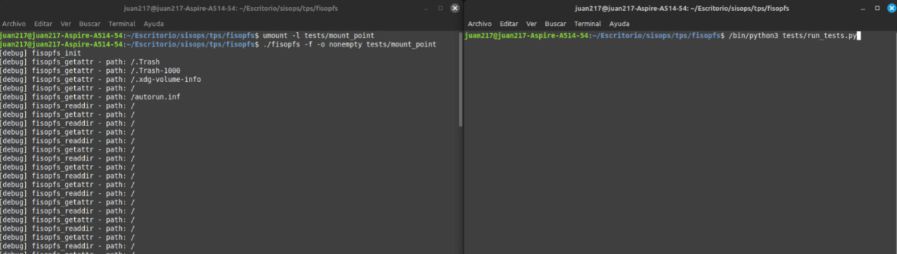

# fisop-fs

## Explicación de aspectos de diseño

1) Las estructuras en memoria que almacenarán los archivos, directorios y sus metadatos:  

    Cada archivo, directorio y metadato, es representado por la restructura `inode_t`, el cual contiene:  
        - `name`: Nombre del archivo o directorio.  
        - `file_size`: Tamaño en bytes.  
        - `type`: Define si es archivo regular, directorio o symlink.  
        - `path`: Es la ruta absoluta.  
        - `file_content`: Contenido, pero solo para archivos regulares, limitado a MAX_CONTENT.  
        - `file_parent`: Ruta del directorio padre.  
        - `nlink`: Cantidad de enlaces (hard links).  
        - `uid, gid, mode`: Metadatos de permisos y propietarios.  
        - `ctime, mtime, atime`: Conocimiento de los tiempos (tiempo de creación, tiempo de modificación, tiempo de último acceso).  

    Tambien tenemos la estructura `super_block_t`, que contiene:  
        - `inodes[MAX_INODES]`: Arreglo con todos los archivos y directorios.  
        - `status_inodes[MAX_INODES]`: Es un arreglo tipo flag, que indica si un bloque ya está siendo 
        ocupado o no.

2) Cómo el sistema de archivos encuentra un archivo específico dado un path  
    Se hace la búsqueda por medio de un recorrido lineal tanto en el array de `inodes[MAX_INODES]` y 
    `status_inodes[MAX_INODES]`. Obteniendo como resultado la dirección de memoria del inodo correspondiente.  

    ```c
    inode_t* buscar_por_path(const char* path) {
        for (int i = 0; i < MAX_INODES; ++i) {
            if (status_inodes[i] == OCCUPIED && strcmp(inodes[i].path, path) == 0) {
                return &inodes[i];
            }
        }
    return NULL;
    }
    ```

3) Todo tipo de estructuras auxiliares utilizadas  
    No se utilizaron estructuras auxiliares además de las ya mencionadas (inode y super_block).  

4) El formato de serialización del sistema de archivos en disco  
    El formato de la serialización, tanto de lectura y escritura, es:

    Lectura: Lee el binario en disco:  
    ```c
    FILE* f = fopen("persistence_file.fisopfs", "rb");
    fread(&superblock, sizeof(super_block_t), 1, f);
    fclose(f);
    ```

    Escritura: Obtiene el binario en disco   
    ```c
    FILE* f = fopen("persistence_file.fisopfs", "wb");
    fwrite(&superblock, sizeof(super_block_t), 1, f);
    fclose(f);
    ```

    Y esto es válido porque no hay punteros internos, todo es contenido plano.  

5) Cualquier otra decisión/información que crean relevante  

    Deciciones en limitaciones:  
    * Solo se pueden tener MAX_INODES archivos totales.  
    * El contenido de archivo está limitado a MAX_CONTENT (100 bytes).
    
    Desafíos:
    * Se ha agregado soporte para enlaces simbólicos y soporte para hard links (ambos son contenidos correspondientes a desafíos https://fisop.github.io/website/tps/filesystem/#desaf%C3%ADos).

## Ejecución de pruebas:  
Posicionados en la carpeta fisopfs (donde se encuentra toda la información del TP), pegamos los siguientes comandos en una terminal:  

1) 
```bash
    umount -l tests/mount_point
```  

2)  
```bash
    ./fisopfs -f -o nonempty tests/mount_point
```
En otra terminal, en la misma ruta donde pegamos los comandos anteriores, introducimos:

```bash
    /bin/python3 tests/run_tests.py
```

Quedando así para poder ejecutar las pruebas utilizando python:

